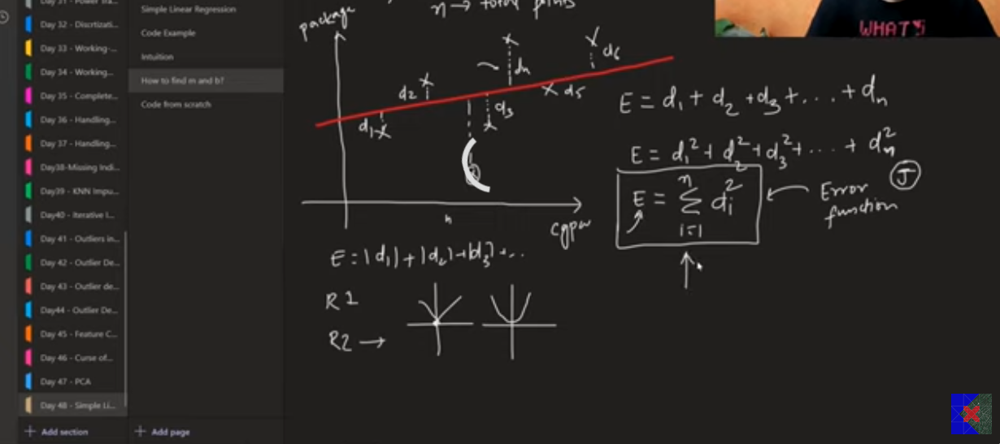
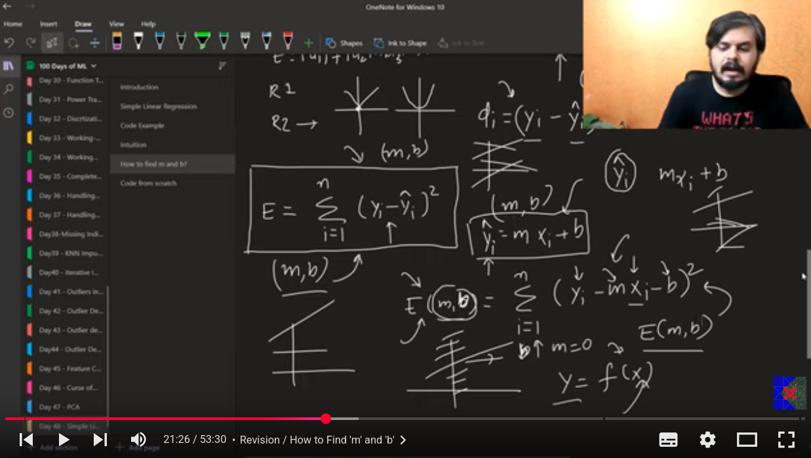
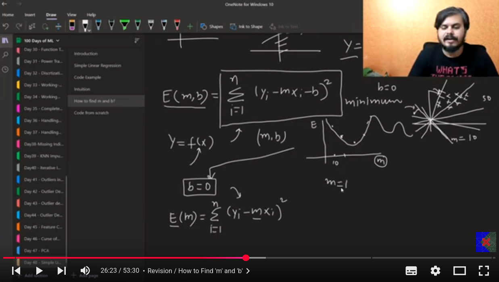
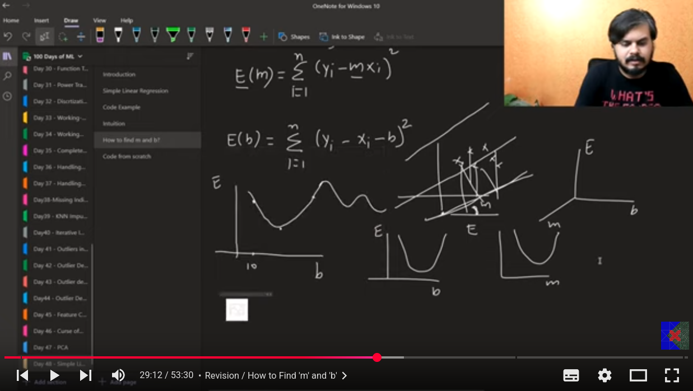
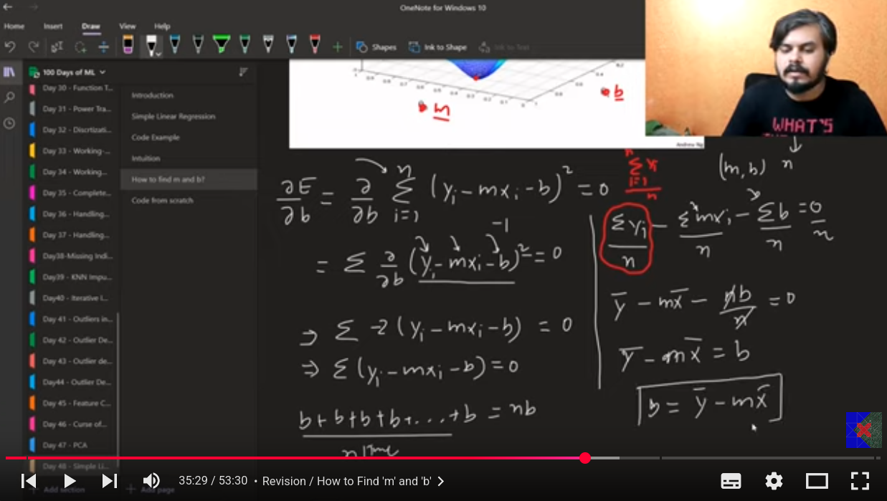

welcome to my day 50/100 of Learning AI

Today I am Leaarning the Mathematical formulation of Linear regression  

# Linear Regression
- the equation for the best fit line of the linear regression is y=mx+b. we have to find the optimum value of the m and b and hence in this way can find the best fit line.  

## closed form solution to find the m and b
- find the m and b values using some fixed formula.  
- known as the OLS ordinary least squares(in LR). 
- the skearn class internally use the OLS method.   

## non closed form solution
- we have to find the approximation formulas to find the b and m using the derivation and the integration.  
- famous technique is the gradient descent.  
- works best on the greater dimension.  
- there is another class in the sklearn named as the SGDRegression that uses the gradeint descent .  

## using OLS method to find the m and b values
following are the formulas
.  

-for finding the best fit line we find the squared distances from the points to the line.We take the square bacause if don't take the square all the values will cancel out each other .we are also not taking the modelus as its not differentiable at zero.  
-actually we are insterested in the most minimized value of the loss function i.e  
  

## Assumptions of Linear Regression (for mathematical correctness):

- Linearity – Relationship between X and y is linear.

- Independence – Observations are independent.

- Homoscedasticity – Constant variance of residuals.

- Normality – Errors are normally distributed.

- No Multicollinearity – Predictors are not highly correlated.