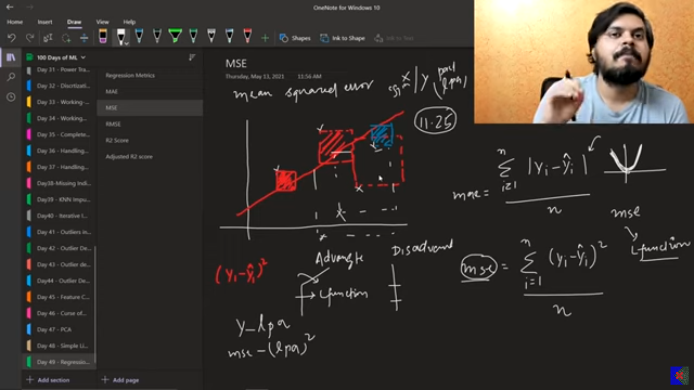
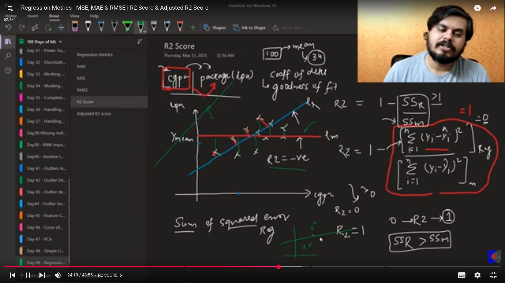
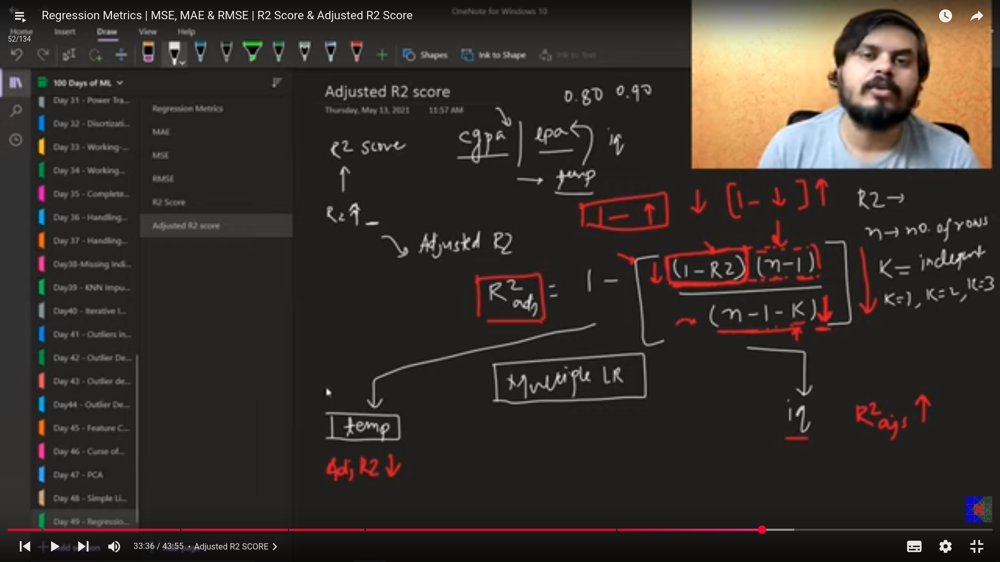

welcome to my day 51/100 of learning AI  
Today I am learning the following topics  

# Regression metrics
## 1. Mean absolute error
find the difference between the actual point and the point predicted by the model and then take their absolute and then find their mean,This is the MAE.  

### advantages
- MAE is the loss , we have to reduce it.  
- the unit of the MAE is that of the target variable i.e the y so then the comparison becomes easy.  
- its not much affected by the outliers.  

### disadvantages
- as its the absolute and its graph is not differentiable at zero then we get problems with certain optimization techniques .  
- to solve this we have the MSE.  

## Mean Squared Error(MSE)
- we use the square function instead of the mode function.  

- can be used as the loss function.  
- its not robust to the outliers.  
- the unit of the target variable gets in the units squared so becomes a little difficult to interpret.  

## Root Mean squared error
- its the square root of thr MSE.  

## R2 score
- also known as the coefficient of determination/goodness of fit.  
- we compare the mean line of the data to the regression line.  
- the r2 score range between 0 and 1 .the nearer the score to the 1 the better the model is performing.  
- if  the r2 score is negative it simply means that we have used the wrong model or the data is non-linear in case of the linear regression.  

- the 0.80 r2 score means that 80% of the variance is explained by the input columns and the remaining 20% can be remained unexplained by some other unknown factors that can't be explained mathematically.  

- unlike the rmse,mse and the mae where the context of the data matters, in the r2 score it gives the overall score of how good our model is doing the regression.  

### issues in the r2 score
- when we add new columns( whether they are beneficial for the ouput or not), sometimes we observe that the r2 score increases which is not a good factor. as it should be like that it should decrease the r2 score if we include the irrelevant columns.  
- adjusted r2-score solves this issue.  

## Adjusted r2 score
- sometimes its more appropriate to use in the multiple LR.  
