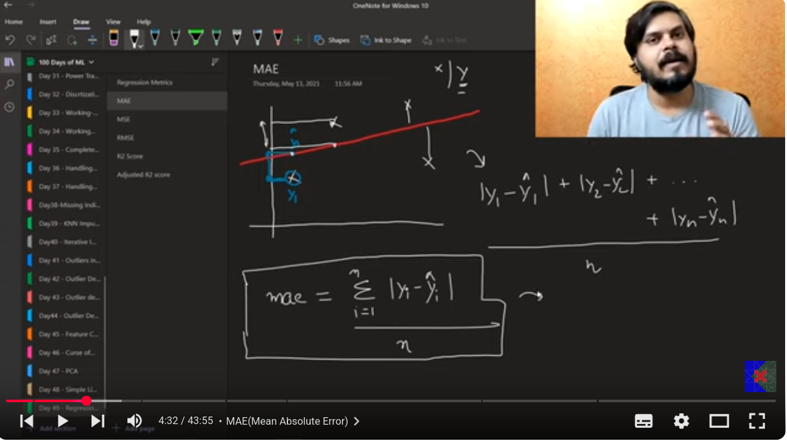

welcome to my day 51/100 of learning AI  
Today I am learning the following topics  

# Regression metrics
## 1. Mean absolute error
find the difference between the actual point and the point predicted by the model and then take their absolute and then find their mean,This is the MAE.  

### advantages
- MAE is the loss , we have to reduce it.  
