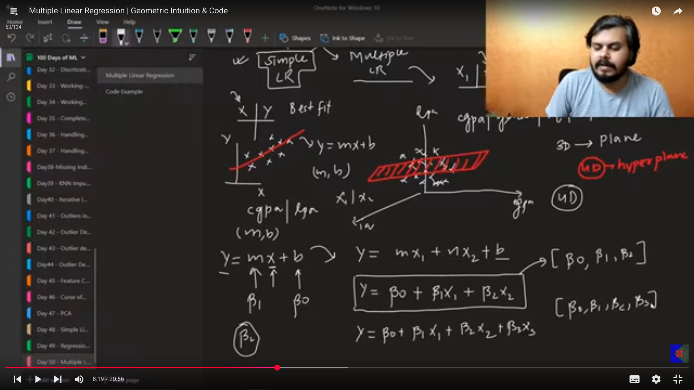
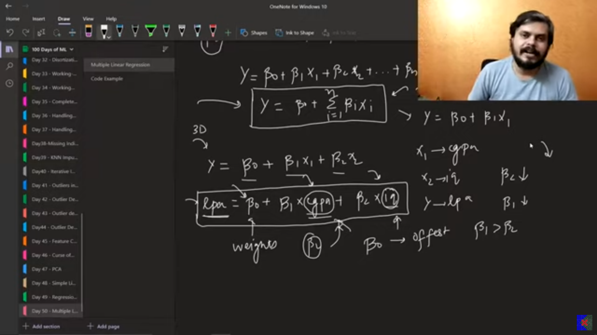
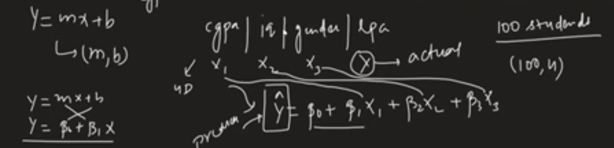
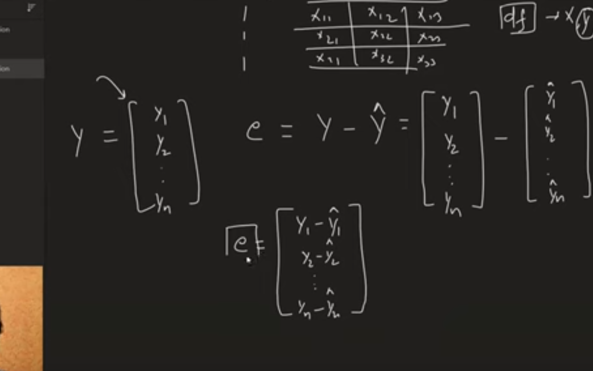
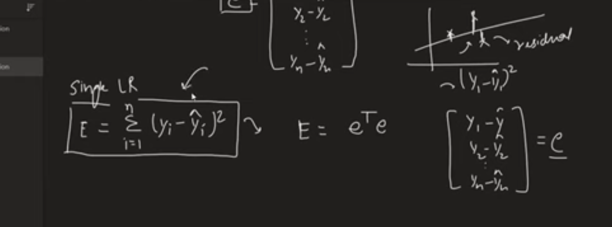
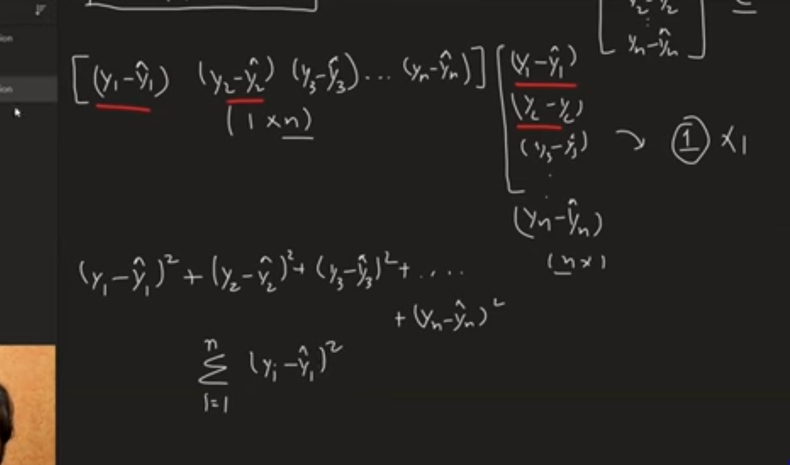
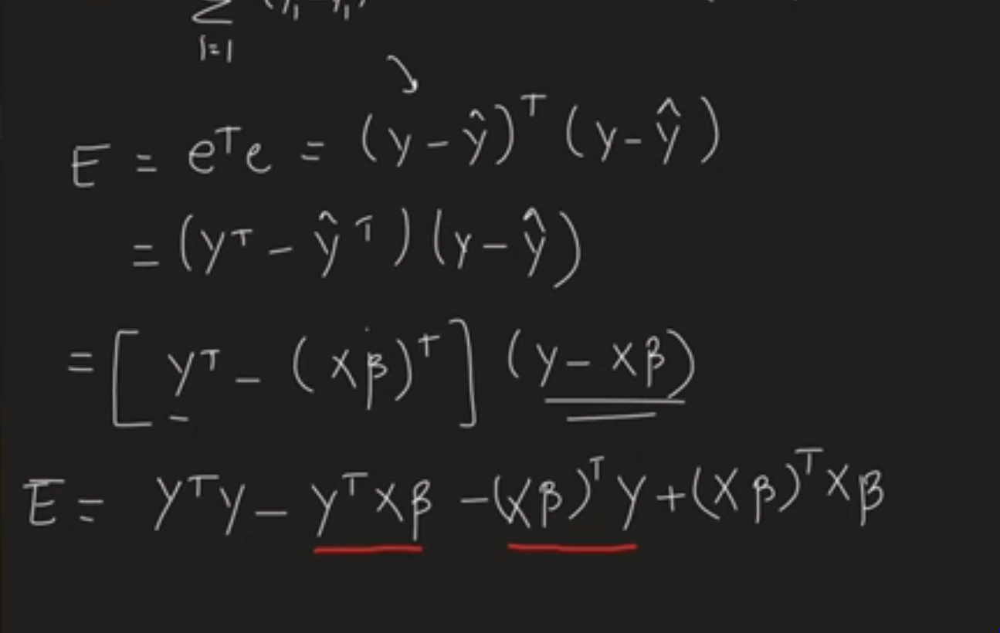
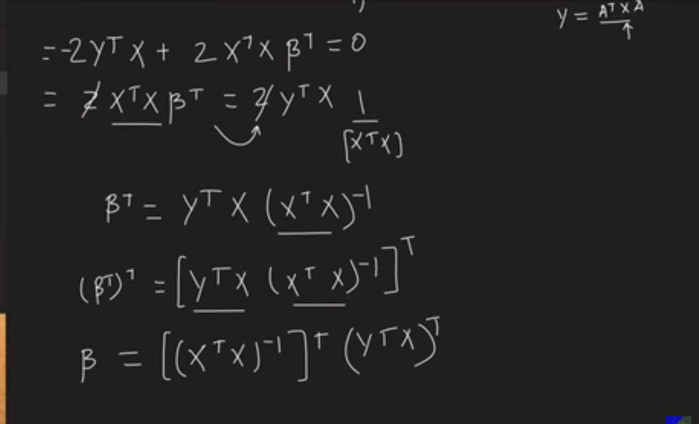
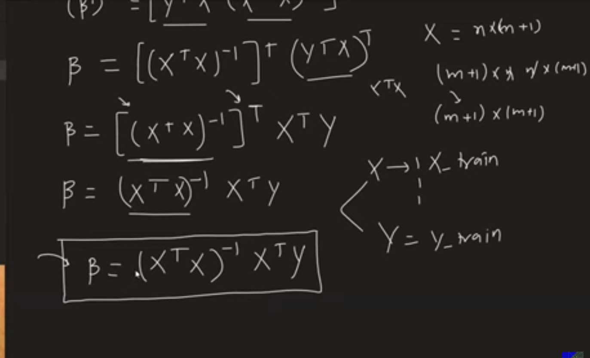
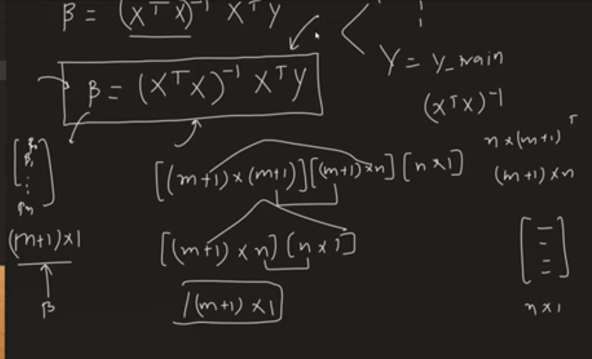

welcome to my day 52/100 of Learning AI
Today I am Learning the following topics

# Multiple Regression
 - when there are more than one columns in the features.  
 - extension of the simple LR.  
 - here we find the best fit plane in the 3D and hyperplane in 4D and onwards.  

 

- B1,B2 are weights means that they tell us how much is the role of that particalur column in predicting the output. 
- the Bo is the ouput and it ensures some value when all other paramaters are zero.  

- in the sklearn.datasets we have a class named as the make_regression() using which we can generate the dataset of our choice.  
- use the lr.coeff_ and lr.intercept_ on the lr trained object.  

## Mathematical formulation

then the y hat metrix becomes as:

y metrix is the target/prediction of all the values.  
B is the values of the coefficients.  
X is the metrix of all the input features.  i.e  

then we have

now we have

then

and now

to prove the equlaity of the mid terms we can do it as follow

now the original equation becomes as :

Here E is the loss function.  

- as we discussed above the simple and the multiple LR uses the OLS method(some specific formula) that finds the values. but in this method(as we can see the above formula) we have to do lot of the computations that slows down the algorithm .  
- solution is the gradient desent where we use the approximation instead of the exact values.  
- SGDRegressor is the class of the sklearn for the linear regression that uses the  gradient descent method in the backend.but its used when the data is extremely higher dimension.  