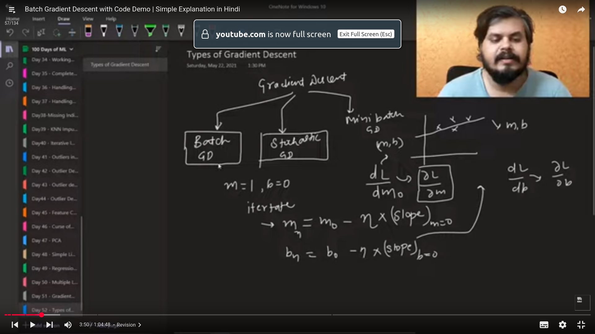
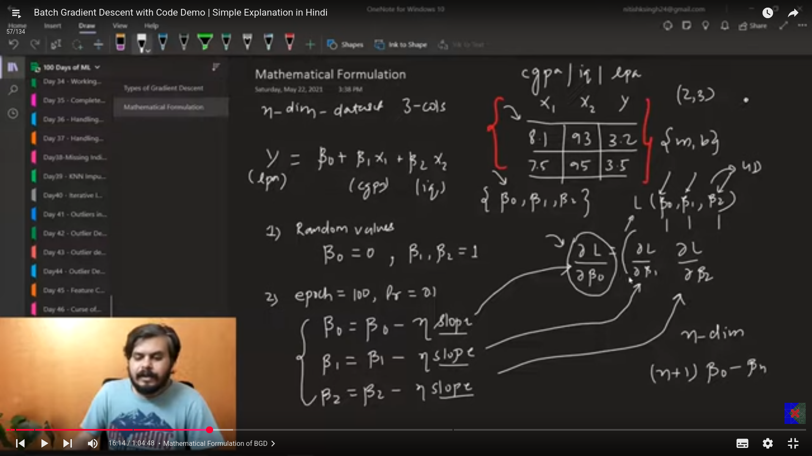

welcome to my day 66-75 of learning AI

These days Iam learning the following topics

# Types of Gradient Descent

- in batch GD we calculate the b and m value on the basis of the whole data and therefore its slow and time consuming.  (used in case of the convex function)
- stochastics GD calculates on the basis of a single row and therefore its faster.  (mostly used,and best for the large datasets.)

